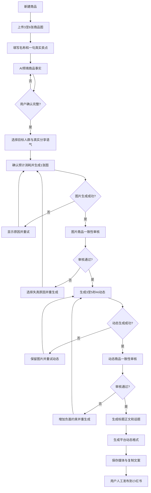

# Muses：小红书 SKU AIGC 内容工作台 MVP 产品文档

版本：V0.2

日期：2026-08-23

状态：首版工程已创建，待 Xcode 与真机验证

产品名称：Muses

## 1. 执行摘要

Muses 是一款面向自有商品的小商家和个人商家的移动端 AIGC 内容工具。用户上传一个 SKU 的实物参考图并确认商品事实后，Muses 生成一张小红书生活方式种草图、一段 3–5 秒 AI 动态内容、iOS Live Photo 与通用 MP4，以及一套小红书标题、正文和话题建议。

第一阶段核心闭环：

`导入 SKU → AI 预填商品事实 → 用户确认 → 生成图片 → 生成 AI 动态 → 商品审核 → 生成小红书文案 → 保存 → 人工发布`

Muses 不把“调用模型成功”视为产品成功。第一阶段要证明的是：

> 用户是否愿意把 Muses 生成的 SKU 内容实际发布到小红书，并在一周内再次使用。

产品参考 Moras 的“商品上下文贯穿生成链路”和“从内容生产走向营销结果”机制，但不复制其品牌、视觉、全托管分佣或 TikTok Shop 业务。MVP 先解决中国本土小商家从商品素材到小红书内容的制作问题。

## 2. 决策与证据边界

### 2.1 已确认决策 `[D]`

- 首批用户是拥有自有商品的个人商家和小商家。
- 首批仅邀请 3–5 名用户，不开放注册。
- 首版使用原生 SwiftUI，仅交付 iOS 17+ iPhone 版本；不使用 React Native 或 Expo。
- 首版只适配小红书，不做抖音。
- 首版不做登录、账号体系、服务端业务系统和埋点。
- 首版直接从客户端请求固定供应商 Endpoint；每位用户使用独立临时 Key。
- 图片默认使用 `gpt-image-2`；图片、视频、文本模型名由本地 JSON 配置。
- 每个创作任务只生成一张 3:4 图片和一段 3–5 秒、720p、静音的 AI 动态。
- 首版输出 Apple Live Photo、MP4 和静态图；Android Motion Photo 移至四周 MVP 的兼容性 Spike。
- 所有最终内容必须经过商品一致性人工审核。
- 内容由用户保存并人工发布，不接小红书 OAuth 或自动发布。
- 首版免费；四周内测成本总上限为 100 元。

### 2.2 已确认事实 `[F]`

- Apple Live Photo 是照片与配对视频资源，不是普通 GIF 或单个 MP4。
- Android Motion Photo 与 Apple Live Photo 不是同一格式。
- Android 没有统一、跨厂商的“创建动态照片”系统 API。
- 小红书没有公开 Android 实况内容的完整输入格式契约。
- Android 能观看由 iPhone 发布的小红书实况内容，不能证明 Android 上传器接受 Apple Live Photo 原始格式。

### 2.3 待真机验证假设 `[H]`

- 若市场反馈支持开发 Android 客户端，Google GContainer Motion Photo 能否被目标 Android 手机相册识别。
- 若市场反馈支持开发 Android 客户端，该 Motion Photo 能否被目标版本的小红书识别并以实况形式发布。
- `gpt-image-2` 在目标供应商接口中对 3–6 张参考图的商品一致性表现。
- 所选视频模型能否在 3–5 秒动态化中保持商品外形、图案、文字和材质。
- 3–5 名内测用户是否愿意实际发布生成内容。

## 3. 目标用户与问题

### 3.1 核心用户

首批用户画像：

- 个人商家或 1–3 人小团队。
- 拥有自己的 SKU 和商品素材使用权。
- 主要在小红书进行商品种草。
- 没有稳定摄影棚、模特、修图师或内容团队。
- 已经在使用生图工具，但需要反复编写提示词、筛选图片和搬运文案。
- 愿意在内测期间直接向产品负责人反馈问题和发布结果。

### 3.2 核心任务 JTBD

> 当我准备在小红书推广一个自有商品时，我希望上传几张商品图，就能获得一套商品没有明显失真、符合小红书表达习惯、可保存和发布的图片、动态内容与文案，从而减少拍摄、写提示词和跨工具搬运的时间。

### 3.3 当前流程

`整理商品图 → 手工写提示词 → 多次生图 → 人工筛图 → 图生视频 → 转换实况格式 → 手工写标题正文 → 保存多个文件 → 打开小红书发布`

主要断点：

1. 商品事实没有成为可复用对象，每次生成都要重新描述。
2. 提示词要求专业，普通用户不知道如何同时约束商品真实性和生活感。
3. 生图、图生视频、Live Photo 转换和文案生成分散在不同工具。
4. AI 可能改变商品特征，但当前流程缺少明确审核门。
5. Android 动态照片格式和小红书兼容性不透明。

## 4. 产品目标与非目标

### 4.1 首版目标

在 2–3 个工作日内，以原生 SwiftUI 在开发者自己的 iPhone 上完成一条固定的真实生成链路：

1. 导入商品图片并建立本地 SKU。
2. AI 预填商品事实，用户完成确认。
3. 使用固定“真人手持生活方式”模板生成一张图片。
4. 将选中图片生成一段 3–5 秒 AI 动态。
5. 在 iOS 生成并保存 Live Photo，同时保留 MP4 和静态图。
6. 生成一套小红书内容包。
7. 完成商品一致性人工审核。
8. 保存媒体并复制文案。

### 4.2 四周 MVP 目标

- 让 3–5 名邀请用户独立完成从 SKU 到保存内容的流程。
- 证明至少一部分内容被实际发布到小红书。
- 记录最常见的商品失真、格式失败和生成返工原因。
- 获得单个“被采用并实际发布的内容包”的真实生成成本。
- 验证用户是否在 7 天内再次创作。

### 4.3 非目标

本阶段不做：

- 小红书 OAuth、自动发布、评论读取或订单归因。
- 抖音内容适配和平台连接。
- 15 秒完整带货视频、多镜头剪辑、数字人和配音。
- 店铺商品同步、链接解析、CSV 批量导入。
- 账号登录、云端项目同步和多人协作。
- 图片局部重绘、时间线编辑器或复杂视频编辑。
- 自动判断“爆款”、承诺销量提升或保证平台审核通过。
- 正式订阅、充值、分佣和支付功能。
- 全 Android 机型实况兼容承诺。
- 首版阶段的 Android 客户端或跨端迁移。

## 5. 北极星指标与指标树

### 5.1 第一阶段北极星指标

> 每名周活内测用户每周实际发布的小红书 SKU 内容包数量。

“北极星”表示当前阶段最能代表用户获得真实价值、并帮助产品做取舍的一个核心结果指标。它不是唯一指标，也不是品牌宣传语。

选择这一指标的原因：

- 生成成功只证明技术可用。
- 保存只证明用户暂时认可。
- 实际发布说明用户愿意让真实消费者看到结果。
- 按“每名周活用户每周”计算，可以避免单个用户一次性批量生成造成虚假繁荣。

首版不做自动埋点，由产品负责人通过直接访谈记录。四周 MVP 是否加入最小匿名统计，在内测后另行决定。

### 5.2 配套指标

`SKU 创建完成率 → 图片生成成功率 → AI动态生成成功率 → 审核通过率 → 保存率 → 实际发布率 → 7日再次创作率`

同时记录：

- 从新建 SKU 到保存内容的总耗时。
- 首图生成耗时和动态生成耗时。
- 商品关键特征误改率。
- 每个任务的重试次数。
- 每个被采用内容包的累计模型成本。
- iOS Live Photo 保存成功率。
- 若四周内启动 Android Spike，再记录 Motion Photo 相册识别率和小红书发布成功率；该指标不属于首版漏斗。

## 6. 核心用户旅程



## 7. 信息架构与页面

首版使用线性流程，避免底部导航和复杂项目管理。

| 页面 | 主要内容 | 主操作 |
|---|---|---|
| 启动/配置 | 固定 Endpoint 提示、临时 Key、连接测试 | 保存并开始 |
| 商品输入 | 3–6 张图片、名称、一句话真实卖点 | AI 识别商品 |
| 商品确认 | AI 预填字段、目标人群、禁改特征、授权确认 | 确认并生成 |
| 生成进度 | 图片/动态当前阶段、已用时间、取消/重试 | 等待或重试 |
| 图片审核 | 原图与生成图对比、审核清单 | 通过/指出问题 |
| 动态审核 | 静态帧、动态预览、审核清单 | 通过/指出问题 |
| 内容结果 | 图片、动态格式状态、3 个标题、正文、话题 | 保存/复制 |
| 本地历史 | 本机 SKU、任务状态、最近结果 | 继续/删除 |

界面原则：

- 每屏只有一个主要任务。
- 表单默认折叠低频字段。
- AI 先预填，用户以确认和纠错为主。
- 高成本操作前显示即将使用的模型和预估消耗。
- 生成任务离开页面后仍可恢复。
- 加载、失败、部分成功、格式不兼容和 Key 无效均有明确状态。

## 8. 功能范围

### 8.1 P0：2–3 日首版

| ID | 功能 | 输入 | 输出 |
|---|---|---|---|
| P0-01 | 本地供应商配置 | 临时 Key、本地 JSON | 可用客户端配置 |
| P0-02 | SKU 建立 | 3–6 张图、名称、真实卖点 | 本地 SKU 草稿 |
| P0-03 | AI 商品预填 | SKU 图片与初始信息 | 可编辑商品事实 |
| P0-04 | 结构化创意模板 | 商品事实、目标人群 | 固定生活方式提示词 |
| P0-05 | 图片生成 | 多参考图、提示词 | 一张 3:4 图片 |
| P0-06 | 图片审核 | 原图、生成图 | 通过或失真标签 |
| P0-07 | AI动态生成 | 审核通过图片、动态提示词 | 3–5 秒 720p MP4 |
| P0-08 | 动态审核 | MP4、商品事实 | 通过或失真标签 |
| P0-09 | 小红书文案 | 商品事实、内容角度 | 3标题、正文、话题 |
| P0-10 | iOS实况封装 | 图片、MP4 | Apple Live Photo |
| P0-11 | 保存与复制 | 审核通过资产 | Live Photo、MP4、静态图、剪贴板文案 |

### 8.2 P1：四周 MVP

- 邀请码或预置授权名单。
- 生成任务本地历史和恢复。
- 稳定实况模式：确定性轻推拉/景深，作为低成本、低失真替代。
- 多种小红书表达语气：真实分享、干货测评、生活方式、好物推荐。
- 失败原因结构化和一键带入下一次生成。
- 供应商成本/额度显示。
- Android Motion Photo 技术 Spike、目标机型兼容记录与是否开发 Android 客户端的决策材料。
- 内容包导出清单和人工发布回填流程。

### 8.3 P2：获得市场反馈后

- 服务端用户、Credits、配置中心和任务编排。
- 小红书平台能力研究与合规连接。
- 抖音内容包适配和官方接口 Spike。
- 帖子数据回填、评论洞察和单变量内容实验。
- 15 秒视频、多镜头脚本和剪辑。
- 订阅 + Credits；参考 Moras 的分层思路，但不直接复制其分佣模式。
- 在真实需求明确后评估 Android/RN 的继续投入范围。

## 9. SKU 与商品事实

### 9.1 最小输入

首屏必填：

- 3–6 张商品实物参考图。
- 商品名称。
- 一句话真实卖点。

AI 预填后由用户确认：

- 商品类目。
- 材质。
- 规格/容量。
- 主色与辅助色。
- 图案、轮廓、包装文字等显著特征。
- 目标人群。
- 1–3 个真实卖点。
- 禁止 AI 改变的特征。
- 素材与营销使用权声明。

无法确定的字段必须保持“不确定/不适用”，不能由模型猜测。

### 9.2 商品快照

每次生成必须引用一份不可变的 `ProductSnapshot`。用户修改材质、规格、图案等事实时创建新快照，历史结果仍引用旧快照，避免审核基线被静默改变。

## 10. 创意和提示词策略

首版只提供“真人手持生活方式”模板，用户不直接编辑底层完整提示词。

提示词结构：

1. 商品事实：外形、材质、颜色、图案、文字、规格关系。
2. 目标人群：用户确认的人群。
3. 使用场景：自然光、日常生活空间、真实手持。
4. 视觉瞬间：商品处于正常使用或展示状态。
5. 构图：3:4，小红书图文适配，商品为视觉主体。
6. 质感：自然、生活感、非影棚过度精修。
7. 禁止项：改变商品事实、增加不存在配件、生成错误文字、虚构效果。
8. 返修约束：来自上一次审核失败标签。

提示词、模型名、参数、参考图顺序和生成结果需要作为一个版本保存。

## 11. 商品一致性审核

图片和动态分别审核，动态不能复用图片审核结果。

审核项：

- 外形和轮廓是否改变。
- 颜色和透明度是否误导。
- 图案数量、位置和纹理是否改变。
- 商品或包装文字是否错误。
- 材质质感是否与实物一致。
- 尺寸和容量关系是否明显错误。
- 是否增加不存在的部件、配件、赠品或效果。
- 文案是否虚构购买经历、使用效果、价格或功效。

审核失败后用户选择原因，系统把原因追加到下一版本负面约束。不提供局部编辑器，不允许未审核资产进入最终保存页。

## 12. 小红书内容包

首版输出：

- 一张 3:4 生活方式图片。
- 一份 iOS Live Photo。
- 一份通用 MP4 保底资产。
- 3 个标题候选。
- 1 篇正文。
- 8–12 个关键词/话题。
- 媒体发布顺序建议。
- AI 内容与商品事实发布前检查清单。

默认语气为“真实分享”，但禁止虚构“我买了”“用了几个月”“亲测有效”等未经用户提供的经历。可使用“适合……场景”“视觉上呈现……”等事实性表达。

## 13. 动态格式产品策略

### 13.1 iOS

- 产品文案：生成并保存 Live Photo。
- 将静态照片和配对视频写入 Photos。
- 同时保留 MP4。
- 保存失败时不丢失 MP4。

### 13.2 Android（四周 MVP Spike，不属于首版）

- 仅做格式与目标机型验证，不在 SwiftUI 首版中向用户展示“生成动态照片”。
- 尝试生成符合 Google GContainer/Motion Photo 规范的文件。
- 写入 MediaStore。
- 同时保留 MP4。
- 只对实际通过测试的手机型号、系统版本和小红书版本标记“已认证”。
- 未识别时提示用户使用 MP4，不宣传全 Android 兼容。

### 13.3 Android 兼容测试（立项条件：iOS 首版获得发布/复用反馈）

每台设备记录：

- 手机品牌与型号。
- Android/厂商系统版本。
- 小红书版本。
- 系统相册是否显示动态标识并可播放。
- 小红书选择器是否显示实况标识。
- 草稿预览是否播放。
- 发布后 iOS 与 Android 是否均可观看。
- 从小红书保存回相册后是否保持动态。

## 14. 数据模型

首版数据全部保存在本机。

```text
AppInstallation
├─ ProviderConfigRef
├─ Product
│  ├─ ProductSnapshot
│  ├─ SourceAsset
│  └─ Creation
│     ├─ PromptVersion
│     ├─ GenerationJob
│     ├─ GeneratedAsset
│     ├─ ReviewDecision
│     ├─ CopyPackage
│     └─ ExportRecord
└─ InitialQuotaLedger
```

关键约束：

- `GeneratedAsset` 必须引用 `product_snapshot_id` 和 `prompt_version_id`。
- 图片与动态使用不同的 `ReviewDecision`。
- `ExportRecord` 只代表保存/复制，不代表已发布。
- 首版无平台帖子 ID，不得自动记为 `published`。
- 临时 Key 不写入业务对象、导出文件或日志。

## 15. 状态机

| 对象 | 状态 |
|---|---|
| SKU | `draft → needs_confirmation → ready → archived` |
| 图片任务 | `draft → submitting → queued → processing → needs_review → approved / rejected / failed / cancelled` |
| 动态任务 | `draft → submitting → queued → processing → downloading → needs_review → approved / rejected / failed / cancelled` |
| 文案任务 | `draft → generating → ready / failed` |
| iOS实况 | `not_started → packaging → saving → saved / failed` |
| Android动态照片（P1 Spike） | `not_started → packaging → saving → unverified / recognized / failed` |
| 内容包 | `draft → ready_to_save → saved` |

任务必须持久化供应商任务 ID。App 退出、网络中断或页面切换后，重新打开可以继续查询，不能盲目重复提交和重复扣费。

## 16. 安全、隐私与合规

### 16.1 首版例外

用户已明确选择首版不建设后端，并将每人独立临时 Key 保存在普通本地存储中。该方案有凭证被设备备份、调试工具、恶意环境或越狱/Root读取的风险，只允许用于受控首版。

必须同时满足：

- 一人一 Key。
- 固定且不可由用户修改的 Endpoint。
- Key 有费用上限、并发上限和短有效期。
- 可随时撤销，首版结束统一轮换。
- Key 不写入日志、错误提示、崩溃上报、剪贴板或导出文件。
- 设置中提供删除 Key。

### 16.2 正式版边界

- 客户端不保存供应商 Key。
- 用户登录后由服务端管理 Credits、模型路由、限额和成本。
- 媒体请求通过服务端短期授权或任务代理。
- 用户素材、商品事实和生成结果具有明确保留期、导出和删除能力。
- 不默认将用户商品素材用于公共模型训练。

### 16.3 内容责任

- 用户必须确认拥有商品图、人物图和品牌素材的使用权。
- AI 预填不是商品事实，只有用户确认后才可进入生成。
- 不生成明显违法、成人违规、侵权或高风险虚假宣传内容。
- 不承诺自动审核等于平台过审。
- 最终发布由用户人工完成并承担商品事实确认责任。

## 17. 免费内测与成本闸门

- 内测用户：3–5 人。
- 每人最多创建 3 个 SKU。
- 每个 SKU 默认生成 1 张图片和 1 次 AI 动态。
- 失败是否补发额度由产品负责人人工判断。
- 单用户同时只能运行 1 个高成本生成任务。
- 四周项目总成本上限：100 元。
- 达到预算 80% 时暂停新增用户并复盘。
- 不提供每日重置免费额度。
- 即使首版没有自动统计，也要通过供应商后台和 Key 配额核对实际成本。

## 18. MVP 上线门槛

以下条件全部满足才进入 3–5 人内测：

- 一台 iPhone 完成 SKU 到 Live Photo 保存的真实链路。
- iPhone 完成静态图、MP4 与 Live Photo 的保存和降级链路。
- Android 不作为首版上线门槛；四周内是否执行 Motion Photo Spike 由 iOS 用户反馈决定。
- 图片和动态任务在 App 切后台/重启后不会静默重复计费。
- 无效 Key、额度不足、供应商超时和结果下载失败均有可操作提示。
- 未审核的图片或动态不能保存为最终内容。
- 商品事实、素材授权和 AI 内容提醒在保存前可见。
- 临时 Key 不出现在日志与导出文件。
- 单次完整任务的实际耗时和成本已记录。

## 19. 主要风险与应对

| 风险 | 影响 | 应对 |
|---|---|---|
| 2–3 日范围过大 | 首版无法按时跑通 | 固定单模板、单图、单动态、单平台、无账号 |
| 直接客户端调用导致 Key 泄露 | 被刷量和产生费用 | 一人一 Key、限额、短有效期、固定域名、结束撤销 |
| 商品失真 | 货不对板、用户不敢发布 | 商品快照、并排审核、失败标签、禁止强制保存 |
| SwiftUI 首版无法覆盖 Android 用户 | 首批可测试用户减少 | 先验证 iOS 发布价值；四周内以 Motion Photo Spike 决定原生 Android 或 RN 投入 |
| 视频任务慢或失败 | 体验中断 | 异步状态、恢复、重试前明确成本 |
| 无埋点无法算指标 | 早期判断主观 | 3–5人直接访谈、发布证据和供应商成本记录 |
| 免费额度被滥用 | 成本超预算 | 受邀用户、单Key限额、总预算100元 |
| 小红书规则变化 | 内容格式或表达不适用 | 人工发布、版本化平台模板、不过度承诺 |

## 20. 名称使用约定

产品名称统一为 `Muses`。对外发布前仍应完成：

- 商标、App Store、安卓商店、域名和社交账号重名检索。
- 对外中文名称与视觉标识的最终确认。
- 避免在副标题中使用“爆单、神器、暴卖”等短期和夸大表达。

工程、target、scheme、产物、Bundle 显示名和文档统一使用 `Muses`。
