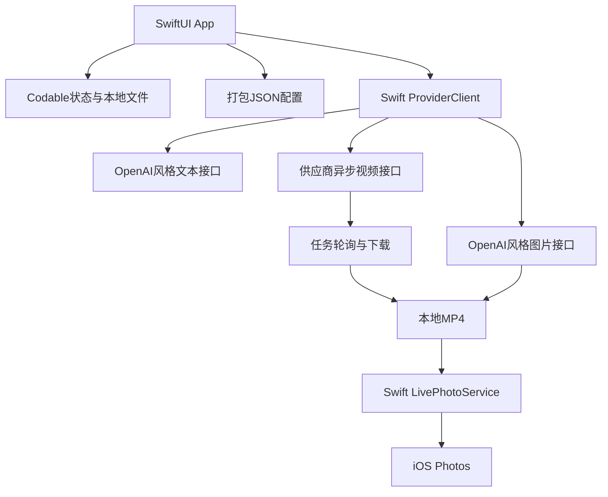
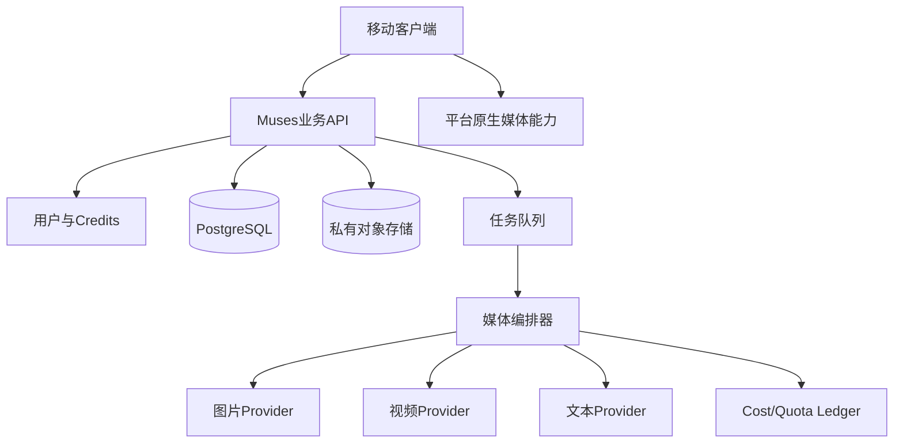

# Muses：技术架构与 API 契约

版本：V0.2

日期：2026-08-23

适用范围：2–3 日首版与四周 MVP 的技术边界

说明：本文是实现前契约，不表示工程已创建、编译或真机验证

## 1. 架构决策

### 1.1 客户端框架

2–3 日首版采用：

- 原生 SwiftUI，最低支持 iOS 17。
- Swift 6；并发逻辑使用 `async/await`、`Task` 与 `actor` 管理。
- `PhotosPicker` 选择 SKU 图片，PhotoKit 保存静态图、视频与 Live Photo。
- AVFoundation 处理媒体校验、配对视频元数据与本地预览。
- URLSession 负责固定供应商 Endpoint 的上传、轮询与下载。
- `Codable` 读取随 App 打包的 JSON 配置和持久化本地任务快照。
- `UserDefaults` 仅保存已明确接受风险的首版临时 Key；业务对象与媒体文件不得写入 `UserDefaults`。

首版不使用 React Native、TypeScript、Expo、Expo Go、Development Build 或跨端桥接层。Apple Live Photo 能力直接作为 Swift 服务实现，不再封装成供 JS 调用的原生模块。

性能判断：

- 主要等待来自远端图片/视频模型，不是 SwiftUI 页面渲染。
- 大文件通过 URLSession 下载到临时文件，再校验并原子移动到 Application Support。
- 视图状态只持有文件 URL 与元数据，不在内存长期持有完整 Base64 或视频字节。
- 媒体封装、相册写入和格式识别由原生框架完成。

Android 客户端不属于首版。只有 iOS 首版获得真实发布和复用反馈后，才对 Android Motion Photo 做独立 Spike，并在原生 Android 与 RN 之间另立技术决策记录。

### 1.2 首版与正式版分层

| 能力 | 首版 | 正式版 |
|---|---|---|
| 客户端 | SwiftUI，iOS 17+ | 基于市场反馈决定继续原生双端或迁移 RN；业务 API 保持平台无关 |
| 用户 | 无登录，本机单用户 | 服务端用户与工作空间 |
| 供应商Key | 用户输入临时、独立Key | 客户端不持有供应商Key |
| Endpoint | 本地JSON硬编码 | 服务端配置与Provider Adapter |
| 模型 | 本地JSON配置 | 服务端路由与灰度 |
| 任务 | 客户端直连、保存远端任务ID | 服务端任务状态机、回调和轮询 |
| Credits | 供应商单Key限额 | 服务端Credits与CostLedger |
| 数据 | 本地 | 服务端主数据 + 本地缓存 |
| 发布 | 保存/复制/打开小红书 | 仍以官方权限和人工确认为准 |

首版的直接客户端调用、普通本地 Key 存储和无后端方案不得被视为正式架构。

## 2. 总体架构

### 2.1 首版



### 2.2 正式版目标



正式版保持平台、模型和供应商三层解耦：

- 小红书/抖音差异只存在于平台模板与发布适配层。
- `gpt-image-2` 等模型名不进入 SKU、Creation 等核心领域对象。
- 供应商 Endpoint、字段映射、轮询方式由 Provider Adapter 管理。

## 3. 推荐工程结构

```text
MusesSwiftUI/
├─ MusesApp.swift
├─ App/
│  ├─ AppRouter.swift
│  └─ AppContainer.swift
├─ Features/
│  ├─ Setup/
│  ├─ Product/
│  ├─ Creation/
│  ├─ Review/
│  ├─ Result/
│  └─ History/
├─ Domain/                     # 与供应商无关的领域模型
├─ Services/
│  ├─ Provider/               # OpenAIStyleProviderClient 等适配器
│  ├─ Persistence/            # Codable 快照、文件目录、UserDefaults Key
│  ├─ Media/                  # 下载、校验、缓存、清理
│  └─ LivePhoto/              # LivePhotoService
├─ Resources/
│  └─ provider.config.json
└─ Tests/
```

首版工程不包含 JS、Expo Module 或 Android 目录。领域对象、Provider 协议和配置字段保持平台无关，未来客户端可依据相同 API 契约重新实现。

## 4. 配置契约

### 4.1 原则

- Endpoint 和模型名随 App 打包。
- 用户界面不能编辑 Endpoint。
- 开发者修改 JSON 后重新构建。
- JSON 不包含实际 Key。
- App 启动时校验 JSON；不合法则阻止高成本调用。
- 配置带 `schemaVersion`，避免字段变更导致静默错误。

### 4.2 示例

```json
{
  "schemaVersion": 1,
  "provider": {
    "id": "muses-provider",
    "baseUrl": "https://media.example.invalid/v1",
    "allowedHosts": ["media.example.invalid"],
    "auth": {
      "type": "bearer"
    }
  },
  "models": {
    "text": "TEXT_MODEL_REPLACE_ME",
    "image": "gpt-image-2",
    "video": "VIDEO_MODEL_REPLACE_ME"
  },
  "text": {
    "path": "/chat/completions",
    "responseTextPath": "choices[0].message.content",
    "timeoutMs": 60000
  },
  "image": {
    "path": "/images/edits",
    "requestEncoding": "multipart",
    "responseMode": "url_or_b64_json",
    "responseUrlPath": "data[0].url",
    "responseBase64Path": "data[0].b64_json",
    "count": 1,
    "aspectRatio": "3:4",
    "timeoutMs": 240000
  },
  "video": {
    "createPath": "/videos/generations",
    "statusPathTemplate": "/videos/generations/{taskId}",
    "taskIdPath": "id",
    "statusPath": "status",
    "resultUrlPath": "data[0].url",
    "statusMap": {
      "queued": ["queued", "submitted"],
      "processing": ["processing", "running"],
      "succeeded": ["succeeded", "completed"],
      "failed": ["failed", "error"],
      "cancelled": ["cancelled", "canceled"]
    },
    "durationSeconds": 5,
    "resolution": "720p",
    "audio": false,
    "pollIntervalMs": 5000,
    "maxPollDurationMs": 900000
  }
}
```

上例中的域名和未确定模型均为占位，不是可执行生产配置。

### 4.3 配置校验

启动时检查：

- `baseUrl` 是 HTTPS。
- 实际请求主机存在于 `allowedHosts`。
- 路径不能覆盖为不同域名。
- 文本、图片、视频模型名非空。
- 图片数量固定为 1。
- 视频时长在 3–5 秒范围。
- 视频分辨率为 720p。
- 轮询间隔不低于供应商限制。
- JSON 未包含 `apiKey`、`secret` 等敏感字段。

## 5. Key存储与请求安全

### 5.1 已确认首版方案

每个内测用户输入产品负责人发放的独立临时 Key。按照已确认决策，首版使用普通本地键值存储，而不是 Keychain/SecureStore。

SwiftUI 首版使用协议屏蔽具体存储：

```swift
protocol CredentialStore {
    func apiKey() -> String?
    func setApiKey(_ value: String)
    func deleteApiKey()
}
```

首版的 `UserDefaultsCredentialStore` 使用普通 `UserDefaults`；正式版移除该协议保存供应商 Key 的用途。该选择不代表安全存储最佳实践，只是用户为受控首版明确接受的临时方案。

### 5.2 风险控制

- 每个用户一把 Key，不能共用主 Key。
- Key 设置金额/调用次数、并发数、模型范围和到期时间。
- Endpoint 固定且设置主机白名单。
- `Authorization` 请求头在调试网络日志中自动脱敏。
- 禁止把完整请求头序列化进错误对象。
- 禁止崩溃上报包含 Key。
- 设置页只能删除和替换，不能复制出完整 Key。
- 首版结束撤销全部 Key。

普通存储的机密性不足是已接受的首版风险。正式版不通过“换成Keychain”继续该模式，而是由后端持有供应商凭证并按 Credits 授权。

## 6. 领域模型

```swift
typealias ID = UUID

struct Product: Codable, Identifiable {
    let id: ID
    var name: String
    let createdAt: Date
    var currentSnapshotID: ID
    var status: ProductStatus
}

struct ProductSnapshot: Codable, Identifiable {
    let id: ID
    let productID: ID
    let sourceAssetIDs: [ID]
    var category: String?
    var material: String?
    var specification: String?
    var colors: [String]
    var visiblePatterns: [String]
    var visibleText: [String]
    var audience: String?
    var verifiedSellingPoints: [String]
    var lockedFeatures: [String]
    var rightsConfirmed: Bool
    var confirmedAt: Date?
}

struct Creation: Codable, Identifiable {
    let id: ID
    let productSnapshotID: ID
    let platform: Platform
    let template: CreativeTemplate
    var imageJobID: ID?
    var videoJobID: ID?
    var copyJobID: ID?
    var status: CreationStatus
    let createdAt: Date
    var updatedAt: Date
}

struct GenerationJob: Codable, Identifiable {
    let id: ID
    let kind: GenerationKind
    var providerTaskID: String?
    let idempotencyKey: UUID
    let model: String
    var status: JobStatus
    var submittedAt: Date?
    var lastPolledAt: Date?
    var errorCode: String?
    var safeErrorMessage: String?
    var outputAssetIDs: [ID]
}

struct ReviewDecision: Codable, Identifiable {
    let id: ID
    let assetID: ID
    let result: ReviewResult
    let issueTypes: [ReviewIssue]
    let note: String?
    let createdAt: Date
}
```

## 7. 本地持久化

建议：

- 结构化对象使用 SQLite 或具备迁移能力的本地数据库。
- 临时 Key 使用已确认的普通键值存储适配器。
- 图片和视频放 App 文件目录，只在数据库存 URI、哈希、大小和 MIME。
- 相册保存后记录平台资产标识（可获得时），不假定原文件永久存在。
- 每个数据库版本有 schema migration，不能依赖清空用户数据升级。

文件目录：

```text
Application Support/Muses/
├─ sources/{productId}/
├─ generated/{creationId}/images/
├─ generated/{creationId}/videos/
├─ packages/{creationId}/
└─ temp/
```

`temp` 可自动清理；商品源图和已采用结果只有用户删除项目时清理。

## 8. Provider Adapter

### 8.1 统一接口

```swift
protocol MediaProvider: Sendable {
    func testConnection() async throws -> ConnectionResult
    func extractProductFacts(_ input: FactExtractionInput) async throws -> ProductFactDraft
    func generateImage(_ input: ImageGenerationInput) async throws -> ImageGenerationResult
    func createVideo(_ input: VideoGenerationInput) async throws -> RemoteVideoJob
    func getVideoJob(taskID: String) async throws -> RemoteVideoJobStatus
    func generateCopy(_ input: CopyGenerationInput) async throws -> CopyPackageDraft
}
```

OpenAI兼容并不代表视频异步接口、参考图字段和结果路径完全统一。所有差异必须留在适配器和 JSON 映射中，页面层不能读取 `choices[0]`、`data[0]` 等供应商字段。

### 8.2 请求公共头

```http
Authorization: Bearer <temporary-user-key>
Content-Type: application/json | multipart/form-data
X-Request-Id: <uuid>
Idempotency-Key: <uuid>
```

供应商不支持幂等键时，客户端仍保存本地幂等键用于防止用户连点；但不能声称可以消除“请求超时、供应商实际已创建任务”的重复计费风险。

## 9. 文本接口契约

### 9.1 商品事实抽取

逻辑请求：

```json
{
  "model": "TEXT_MODEL_REPLACE_ME",
  "input": {
    "productName": "用户填写的名称",
    "sellingPoint": "用户填写的一句话卖点",
    "images": ["local-image-reference-1", "local-image-reference-2"]
  },
  "responseSchema": {
    "category": "string|null",
    "material": "string|null",
    "specification": "string|null",
    "colors": ["string"],
    "visiblePatterns": ["string"],
    "visibleText": ["string"],
    "lockedFeatures": ["string"],
    "uncertainFields": ["string"]
  }
}
```

要求模型只描述图片可见或用户已提供信息，无法确认必须返回 `null` 或加入 `uncertainFields`。

### 9.2 小红书文案

输入：

- 已确认商品事实。
- 目标人群。
- 固定真实分享语气。
- 生成图片与动态的结构化创意摘要。
- 禁止表达列表。

输出必须解析为结构化 JSON：

```json
{
  "titles": ["标题1", "标题2", "标题3"],
  "body": "正文",
  "topics": ["话题1", "话题2"],
  "factClaims": [
    {"claim": "文案中的事实", "sourceField": "verifiedSellingPoints[0]"}
  ],
  "warnings": []
}
```

解析失败只重试文本请求，不重复生成图片或动态。

## 10. 图片接口契约

多参考图优先使用支持图片编辑/参考图输入的接口。逻辑输入：

```swift
struct ImageGenerationInput: Sendable {
    let model: String                 // gpt-image-2
    let prompt: String
    let referenceImageURLs: [URL]     // 3–6
    let count: Int                    // 固定为 1
    let aspectRatio: String           // 固定为 3:4
    let outputFormat: ImageFormat
    let idempotencyKey: UUID
}
```

逻辑输出：

```swift
struct ImageGenerationResult: Sendable {
    let remoteRequestID: String?
    let remoteURL: URL?
    let base64: String?
    let mimeType: String
    let revisedPrompt: String?
}
```

规则：

- URL结果必须下载到本机，不能把临时URL当永久资产。
- Base64结果立即写文件，写入后从内存释放。
- 下载验证状态码、MIME、大小上限和文件签名。
- 保存 SHA-256，避免重复下载和资产错配。
- 记录完整配置摘要，但不记录 Key。

## 11. 视频异步接口契约

### 11.1 创建

逻辑请求：

```swift
struct VideoGenerationInput: Sendable {
    let model: String
    let imageURL: URL
    let prompt: String
    let durationSeconds: Int          // 3、4 或 5
    let resolution: String            // 固定为 720p
    let audio: Bool                   // 固定为 false
    let idempotencyKey: UUID
}
```

逻辑响应：

```json
{
  "taskId": "provider-task-id",
  "status": "queued"
}
```

创建成功后必须先持久化 `providerTaskId`，再更新页面。不能只保存在内存。

### 11.2 查询

统一映射为：

```swift
enum RemoteVideoStatus: String, Codable, Sendable {
    case queued, processing, succeeded, failed, cancelled, unknown
}

struct RemoteVideoJobStatus: Codable, Sendable {
    let taskID: String
    let status: RemoteVideoStatus
    let progress: Double?
    let resultURL: URL?
    let safeError: String?
}
```

轮询规则：

- App 前台按配置间隔查询。
- App 切后台时取消前台轮询 `Task`，不承诺后台持续运行。
- 恢复前台后读取未完成任务并继续查询。
- 达到客户端总等待上限后标记 `unknown`，不把远端任务改成 `failed`。
- 只有远端明确失败才允许创建重试任务。
- 结果下载失败只重试下载，不重新生成。

## 12. 提示词版本

每次任务保存：

- `productSnapshotId`。
- 模板版本，例如 `handheld_lifestyle_v1`。
- 商品事实块。
- 场景、构图、受众和平台块。
- 负面约束。
- 上次审核失败标签。
- 模型名、供应商配置版本和生成参数。

不得静默覆盖旧提示词；重新生成创建新 `PromptVersion`。

## 13. iOS Live Photo 服务

### 13.1 Swift 接口

```swift
protocol LivePhotoServing: Sendable {
    func createAndSave(photoURL: URL, videoURL: URL) async throws -> LivePhotoSaveResult
}

struct LivePhotoSaveResult: Sendable {
    let localIdentifier: String?
    let status: LivePhotoSaveStatus
}
```

### 13.2 服务职责

- 校验输入图片、视频存在且可读取。
- 为照片与配对视频写入一致的资产标识。
- 写入视频仍帧时间等必要元数据。
- 通过 Photos 框架创建照片和 `pairedVideo` 资源。
- 处理只添加照片权限、权限拒绝和保存失败。
- 返回系统资产标识，不把媒体字节复制到 SwiftUI 视图状态。

Apple格式参考：

- [PHAssetResourceType.pairedVideo](https://developer.apple.com/documentation/photos/phassetresourcetype/pairedvideo)
- [PHAssetCreationRequest](https://developer.apple.com/documentation/photos/phassetcreationrequest)

## 14. Android Motion Photo Spike（非首版交付）

本节仅保留未来验证契约。SwiftUI 首版不包含 Android 客户端、Kotlin 模块、MediaStore 写入或 Motion Photo 用户入口。只有 iOS 首版获得真实发布和复用反馈后，才执行本节 Spike。

### 14.1 未来逻辑接口

```kotlin
interface MotionPhotoService {
    suspend fun createAndSave(
        photoUri: Uri,
        videoUri: Uri,
    ): MotionPhotoSaveResult
}

data class MotionPhotoSaveResult(
    val contentUri: Uri,
    val status: MotionPhotoStatus,
    val detail: String? = null,
)

enum class MotionPhotoStatus {
    RECOGNIZED,
    UNVERIFIED,
}
```

### 14.2 原生职责

- 读取图片与视频文件，不将完整内容传回 UI 层。
- 生成符合 Google Motion Photo/GContainer 规范的 XMP 与容器布局。
- 将结果写入 MediaStore。
- 返回 `content://` URI。
- 尽可能检查系统相册是否按动态照片展示；无法确认时返回 `unverified`。
- 合成失败时不删除原始 MP4。

Google格式参考：

- [Android Motion Photo format](https://developer.android.com/media/platform/motion-photo-format)
- [Android shared media/MediaStore](https://developer.android.com/training/data-storage/shared/media)

格式正确不等于所有 OEM 相册或小红书均能识别。未来 Android App 不能仅依据文件生成成功返回“可发布实况”。

## 15. Android小红书兼容验证

认证键：

`deviceModel + osVersion + xiaohongshuVersion + containerVersion`

每组执行：

1. App 生成 Motion Photo。
2. 系统相册是否显示动态标志并播放。
3. 在小红书内选择该资产，是否显示实况标志。
4. 草稿预览是否播放。
5. 实际发布后分别用 iOS、Android观看。
6. 从小红书保存回相册后是否保留动态。

测试结果：

- `certified`：上述核心步骤通过。
- `partial`：相册识别，但小红书不识别或发布后静态化。
- `unsupported`：相册不识别。
- `untested`：未完成真机测试。

MVP只对 `certified` 组合显示“当前设备已验证”。

## 16. 任务恢复与幂等

高成本任务创建步骤：

1. 本地创建 `GenerationJob(draft)` 和 UUID 幂等键。
2. 状态改为 `submitting` 并持久化。
3. 发送请求。
4. 图片同步返回时保存远端请求 ID 和结果。
5. 视频返回任务 ID 后立即持久化。
6. 更新为 `queued/processing`。
7. 下载完成后保存文件哈希并进入 `needs_review`。

如果请求超时发生在第3步：

- 供应商支持幂等键：使用同一键重试。
- 供应商支持按客户端请求ID查询：先查询。
- 两者都不支持：状态为 `submission_unknown`，需要用户明确确认可能重复扣费后才新建任务。

## 17. 网络、文件与内存

- 媒体上传使用文件流/原生URI，不转换为大Base64字符串。
- 下载到临时文件，完成校验后原子移动到正式目录。
- 限制单文件体积、MIME和像素尺寸。
- 对临时签名 URL 设置超时与重试。
- 请求取消只取消客户端等待；远端任务可能仍计费，UI必须说明。
- App启动时清理超过保留期且未被任务引用的临时文件。
- 低存储空间时阻止动态生成并提示用户清理。

## 18. 错误与日志

结构化错误：

```ts
interface AppError {
  code: string;
  userMessage: string;
  retryable: boolean;
  safeContext?: Record<string, string | number | boolean>;
}
```

禁止记录：

- `Authorization`。
- API Key。
- 完整用户提示词中的敏感商品资料。
- 本地绝对照片路径。
- 供应商临时签名 URL 的查询参数。

允许记录：

- 本地任务 ID。
- 脱敏的供应商请求 ID。
- 模型名、耗时、状态和错误类别。
- 文件大小、MIME和哈希前缀。

## 19. 正式版迁移契约

首版之后迁移服务端时保持以下逻辑契约不变：

- `MediaProvider` 的逻辑输入输出。
- `GenerationJob` 状态机。
- `ProductSnapshot` 和审核模型。
- 本地文件与相册服务的职责边界。

将 `DirectProviderAdapter` 替换为 `MusesBackendAdapter`：

```text
首版: App → 固定供应商
正式: App → Muses后端 → Provider Adapter → 供应商
```

正式版后端至少负责：

- 登录、用户和设备会话。
- Credits、配额、CostLedger。
- 供应商 Key、路由、熔断和回退。
- 任务幂等、回调验签、轮询和对账。
- 私有对象存储与短期签名URL。
- 配置灰度、模型版本和禁用开关。
- 退款/失败额度规则和审计。

## 20. 开发前置清单

- [x] 固定首版 Endpoint 已确认并使用 HTTPS。
- [ ] 文本模型名已填入 JSON。
- [ ] 视频模型名已填入 JSON。
- [ ] 图片参考图接口、字段和返回格式已用最小请求验证。
- [ ] 视频创建/查询接口和全部状态值已记录。
- [ ] 每位测试用户的独立 Key 已配置限额和有效期。
- [ ] iOS开发签名和测试设备可用。
- [x] SwiftUI 首版的最低 iOS 版本已记录为 iOS 17；目标 iPhone 待用户确认。
- [ ] 供应商素材保留、训练使用和删除规则已确认并写入内测说明。
- [ ] 小红书真实发布测试由用户人工执行，不通过自动化代发。

## 21. 尚未执行的验证

截至本文 V0.2 修订日期：

- SwiftUI 首版工程已创建并统一命名为 `Muses`。
- 工程结构与关键调用路径已经静态检查，但未执行编译或运行验证。
- 尚未运行 SwiftUI iOS 构建或真机验证。
- 尚未调用真实文本、图片或视频接口。
- 尚未生成或保存真实 Live Photo。
- 尚未在小红书执行发布。

实现阶段若当前仓库成为 iOS/Xcode 项目，依照全局工作约定，不自动运行 `xcodebuild`、模拟器构建或依赖安装；这些步骤由用户在 Xcode/本机环境中执行，代码侧采用静态检查并提供手工验证步骤。
