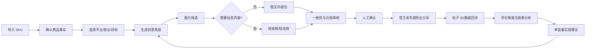

# SKU 种草内容增长工作台：产品分析

版本：V0.1

日期：2026-08-21

定位阶段：机会定义与 MVP 立项前

## 1. 执行摘要

建议将产品定位为：

> 面向抖音、小红书种草卖货创作者与小商家的 SKU 内容增长工作台。用户导入一个商品后，系统持续产出可审核的图片、短视频与轻动效，协助发布和数据回流，并把评论、内容表现和成交信号沉淀为下一轮创意与商品方向。

它不是另一个“输入一句话出图”的模型壳。真正的产品价值在于把目前断裂的工作串成闭环：

`SKU 事实 → 创意角度 → 素材版本 → 人工审核 → 发布记录 → 内容/商品数据 → 评论洞察 → 下一轮实验`

机会真实，但应分阶段实现。现阶段最确定的是 SKU 内容生产和版本管理；最不确定的是平台 OAuth、自动发布、评论与订单级归因权限。MVP 应先证明“用户是否持续用生成内容发布”，而不是先承诺全自动销售闭环。

## 2. 研究证据与边界

### 2.1 已观察事实 `[F]`

| 证据 | 观察 | 产品含义 |
|---|---|---|
| 图一：现有工具日志 | 同一用户在同日连续生成同一杯子相关素材；提示词重复强调“真人手持实拍感、真实、生活感、精致少女心”；使用 1/2/4 张参考图，3:4、1K；单次约 67–170 秒 | 用户在围绕同一 SKU 反复试错；提示词、参考图、模型、参数、耗时和候选结果需要版本化 |
| 图二：生成结果 | 波点玻璃杯被真人手持，粉色花卉、镜子、香水和书本形成生活方式场景 | 用户需要的不是白底商品图，而是“商品真实性 + 账号审美 + 使用情境”的种草素材 |
| 图三：抖音场景 | 内容以三图轮播、标题、多个商品/兴趣标签发布，页面存在点赞、收藏、评论和分享入口 | 最终交付物是完整内容包，至少包括图片顺序、封面、标题、正文、标签和互动数据，不只是单张图片 |
| 既有 Moras 研究 | Moras 将选品、生成、发布和归因连接成闭环 | 对标重点应是上下文和数据闭环，不是照搬视觉或“AI 专家”名称 |

### 2.2 合理推断 `[I]`

当前用户流程大概率是：

`寻找/拍摄参考图 → 反复手写相似提示词 → 多次生成 → 人工挑图 → 人工写标题/标签 → 手动发布 → 分散查看互动或销售`

主要断点：

1. 商品没有成为系统的一等对象，每次创作都要重新描述。
2. 候选图之间缺少可比较的变量和版本关系。
3. “生成成功”不等于“可发布”，缺少一致性与合规审核。
4. 素材、平台帖子、评论和销售结果之间没有稳定 ID 关系。
5. 用户无法知道究竟是商品、场景、开头、标题还是发布时间带来差异。

### 2.3 待验证假设 `[H]`

- 用户是否拥有店铺、联盟带货或品牌合作身份，以及可获得何种成交数据。
- 抖音/小红书对目标主体开放哪些 OAuth scope、内容发布、挂商品、评论和订单接口。
- 用户更需要图文、短视频还是所谓“Live 动图”；后者需要先明确是 GIF、循环 MP4，还是 Apple Live Photo 成对资产。
- 用户可接受的单条内容成本、等待时间和月订阅价格。
- 用户是否愿意授权历史内容、评论和订单数据用于个性化，但不用于公共模型训练。

## 3. 目标用户和 JTBD

### 3.1 核心用户：个体种草创作者/小店主

特征：1–3 人团队、SKU 少到中等、缺少稳定摄影布景和剪辑能力、主要靠自然流量或轻投放。

JTBD：

> 当我准备推广一个商品时，我希望用现有商品图快速获得符合账号调性的可发布图文/短视频，并知道哪种表达值得继续做，从而降低拍摄、试错和复盘成本。

### 3.2 次级用户：多 SKU 小商家/品牌运营

JTBD：

> 我希望批量维护商品事实、品牌风格、内容版本和结果，知道哪个“SKU × 卖点 × 场景 × 内容形式”值得持续投入。

### 3.3 P1 用户：代运营/内容工作室

需要多客户隔离、成员权限、审批、批量任务和成本台账。首版不作为主角色，避免协作复杂度挤压核心闭环。

## 4. 产品价值主张

### 4.1 对用户的直接价值

- 一个 SKU 的资料只确认一次，后续图片、视频和文案共享事实上下文。
- 将“写提示词”改造成结构化创意简报，普通用户不需要理解模型参数。
- 一次生成多个有明确变量的候选，而不是无记录地重复抽卡。
- 商品一致性、敏感表达、版权和平台规格在发布前集中审核。
- 按 SKU、内容版本和平台帖子查看效果，并生成可追溯的下一步建议。

### 4.2 差异化方向

| 能力 | 通用生图/视频工具 | 平台原生创作工具 | 本产品 |
|---|---|---|---|
| SKU 事实约束 | 弱，依赖提示词 | 中，通常只在平台内 | 强，贯穿生成、审核、发布和归因 |
| 账号审美记忆 | 模板或历史项目 | 有限 | 品牌/账号画像、风格资产和禁用元素 |
| 图片到视频/轻动效 | 分散工具链 | 部分支持 | 同一 AssetVersion 派生，多格式输出 |
| 评论驱动创意 | 通常没有 | 看数据但不直接产出版本 | 评论证据 → 洞察 → 创意变量 → 人工确认 |
| A/B 版本关系 | 用户手工记忆 | 平台数据分散 | Experiment/Arm 与素材、帖子、指标关联 |
| 销售归因 | 通常没有 | 平台内最强 | 在平台允许范围内汇总；无权限时明确降级 |

## 5. 核心产品循环

“生成”可以自动，“发布”和“改变商品卖点/人群方向”默认需要人工确认。系统不能用少量自然流量数据自动宣布爆款公式。

## 6. 信息架构建议

移动端建议采用四个一级入口：

1. **今日任务**：待确认 SKU、生成中、待审核、待发布、同步异常、实验结论。
2. **商品库**：SKU、商品事实、参考素材、关联内容和商品级表现。
3. **内容**：创意简报、图片/视频/轻动效版本、审核和发布记录。
4. **数据**：平台、账号、SKU、内容、实验维度的数据与洞察。

设置中管理账号连接、品牌画像、受众画像、资产授权、配额、计费和隐私。

不要把“生图、生视频、写文案、发布”做成互相独立的工具页；所有任务都应挂在 SKU 和 Campaign/Experiment 下。

## 7. MVP 取舍

### 7.1 MVP 必须证明

`一个 SKU 能否稳定变成用户愿意发布的种草内容，并能回收至少一种结果数据。`

### 7.2 MVP 范围

- 单用户、单工作空间。
- SKU 手动、CSV 或商品链接导入，抽取结果必须人工确认。
- 图片为主要内容形式；支持一种图转短视频/轻动效能力。
- 抖音/小红书规格的导出包和系统分享，不依赖自动发布审批。
- 标题、正文、标签、封面建议。
- 人工审核清单、版本对比、失败重试和成本/耗时日志。
- 用户回填帖子 URL；数据先支持 CSV/手工导入。
- 单 SKU、单变量创意对照实验。

### 7.3 首版不做

- 不同时承诺抖音和小红书全自动发布。
- 不承诺评论、订单或 GMV 的实时同步。
- 不做黑盒自主改提示词并自动发布。
- 不做多账号机构审批、数字人、声音克隆和复杂选品市场。
- 不把 GIF、MP4 与 Apple Live Photo 混为同一能力。
- 不宣传“保证爆款”“保证提高销售”。

## 8. 商业模式假设

建议从可控成本收费开始：

- 免费试用：少量图片候选、带限制的导出。
- 个人订阅：每月基础额度 + 超额生成包。
- 专业订阅：视频/轻动效、高分辨率、品牌资产、更多 SKU 和数据保留。
- 团队版（P1）：成员、审批、多账号、客户工作空间和成本中心。

在无法稳定拿到平台订单归因前不建议按 GMV 抽佣。单位经济应跟踪：

`采纳素材成本 = 该内容链路全部生成/重试成本 + 转码/存储成本 + 可变平台服务成本`

不能只计算最后一张成功图，因为图一显示用户会对同一 SKU 多次迭代。

## 9. 成功指标

北极星指标：

> 每个周活跃创作者产生的“已发布且拥有可用结果数据的 SKU 内容数”。

前置指标：

- SKU 首次确认完成率。
- SKU 确认到首个可审核候选的 P50/P90 时间。
- 生成成功率、候选采纳率、商品一致性初审通过率。
- 审核到导出/发布率、帖子 ID/URL 绑定率。
- 7/30 日重复创作率、单 SKU 二次创作率。
- 单个采纳素材的总成本与返工次数。
- 收藏率、评论率、商品点击率、订单率和退款后 GMV（有合法数据来源时）。

## 10. 结论

该方向值得进入设计伙伴验证，理由不是宏观概念，而是已经出现了真实的重复使用行为和明确落地场景。能否形成业务，则取决于三件事：

1. 用户是否愿意持续把 SKU 放入系统，而不是偶尔生一张图。
2. 生成内容是否保持商品真实、符合账号调性并被实际发布。
3. 在平台权限有限时，能否仍用导出、回填和结构化实验提供可感知价值。

建议先招募 5 名设计伙伴做 4 周试点，再决定自动发布、评论学习和销售归因的投入顺序。
