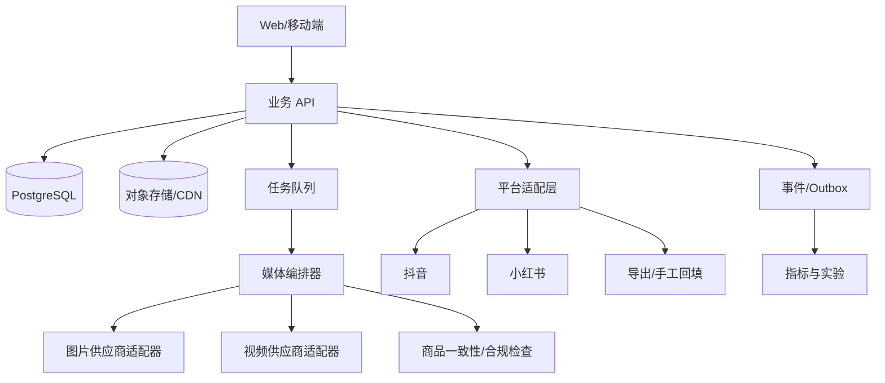

# SKU 种草内容增长工作台：可行性与市场前景

版本：V0.1

日期：2026-08-21

## 1. 结论

综合判断：**值得做小规模设计伙伴验证，但不适合直接按“抖音/小红书全自动带货闭环”重投入。**

技术上，SKU、媒体生成、版本、审核、导出、数据导入、评论 NLP 和创意实验都可实现；商业上的真实机会也已从现有用户的重复生成与抖音种草使用得到初步验证。最大不确定性不在 AI 模型，而在平台资质、商品真实性、归因数据和单位经济。

建议将项目分成两层：

1. **不依赖平台特权的核心产品**：SKU → 可发布素材 → 审核 → 导出/分享 → URL/数据回填。
2. **需要平台审批的增强层**：OAuth、自动发布、商品挂载、评论/指标/订单同步。

这样即使平台权限暂时不可得，产品仍能交付核心价值。

## 2. 技术可行性

### 2.1 可行能力

| 能力 | 可行性 | 说明 |
|---|---|---|
| SKU/商品事实卡 | 高 | 常规结构化数据、OCR/视觉抽取 + 人工确认；关键是版本不可变 |
| 多参考图生图 | 高 | 现有工具已经有真实成功记录；需要任务队列、版本和成本治理 |
| 图生视频/轻动效 | 中高 | 媒体 API 可异步完成；商品形变、时延、成本和平台格式是主要问题 |
| Apple Live Photo | 中 | 需要 JPEG/HEIC + MOV 配对及元数据；平台上传兼容性需设备实测 |
| 标题/标签/脚本 | 高 | 文本模型成熟；必须由 SKU 事实约束并做敏感/夸大表达检查 |
| 商品一致性检测 | 中 | 可用视觉对比/规则做风险提示，但不能替代人工确认 |
| 评论聚类和洞察 | 高 | 文本分类/聚类成熟；需要合法来源、去标识化和证据回溯 |
| A/B 实验管理 | 高 | 版本、指标和规则系统可做；自然流量因果解释难度高 |
| 数据看板 | 高 | 取决于数据源；手工/CSV 可先落地 |
| 跨平台自动发布/归因 | 中低/不确定 | 工程本身可做，真正约束是平台开放 scope、主体资质与审核 |

### 2.2 推荐技术架构

核心原则：

- 平台适配层和领域模型分离，不能让抖音/小红书字段散落到所有服务。
- 图片/视频模型也通过 Provider Adapter 隔离，保留多供应商路由和熔断。
- 长任务采用持久化状态机、幂等键和回调/轮询，不把页面等待当任务状态。
- 发布采用 `PublishRecord → PlatformPost` 两阶段，处理超时但实际成功的情况。
- 每次生成、转码、存储、下载和重试写 CostLedger。

### 2.3 图一暴露的工程约束

图一的单次成功时延约为 67–170 秒，同一 SKU 有多次生成。这意味着：

- 必须异步，不适合阻塞式接口和前台等待。
- 需要低清预览、批量候选上限、取消、部分成功和失败重试。
- 必须按“采纳素材累计成本”计算毛利。
- 用户体验要显示状态和范围，不能给虚假精确倒计时。
- 多参考图上传、生成和清理需要对象生命周期管理。

## 3. 平台可行性

### 3.1 抖音官方公开能力

- `[F]` 抖音开放平台面向移动/网站应用提供抖音授权、投稿和数据能力：[抖音开放平台](https://developer.open-douyin.com/)。
- `[F]` 官方有登录授权、换取和刷新 access token 的流程：[授权总览](https://developer.open-douyin.com/docs/resource/zh-CN/dop/develop/sdk/mobile-app/permission/overall-permission)、[获取 access_token](https://developer.open-douyin.com/docs/resource/zh-CN/dop/develop/openapi/account-permission/get-access-token)、[刷新 access_token](https://developer.open-douyin.com/docs/resource/zh-CN/dop/develop/openapi/account-permission/refresh-access-token)。
- `[F]` 官方公开了授权账号创建视频和查询账号视频列表的接口文档：[创建视频](https://developer.open-douyin.com/docs/resource/zh-CN/dop/develop/openapi/video-management/douyin/create-video/video-create)、[账号视频列表](https://developer.open-douyin.com/docs/resource/zh-CN/dop/develop/openapi/video-management/douyin/search-video/account-video-list)。
- `[F]` 官方视频数据方案可在申请对应权限后查询授权账号公开作品的一段时间内的播放、点赞、评论、分享等数据，口径和时效受权限限制：[视频数据管理](https://developer.open-douyin.com/docs/resource/zh-CN/dop/ability/open-data/video-data-solution)。
- `[F]` POI 等发布附加能力为定向开放，特定交易金额接口也绑定小程序推广/撮合任务关系：[视频 POI](https://developer.open-douyin.com/docs/resource/zh-CN/dop/develop/openapi/video-management/douyin/search-video/video-poi)、[推广任务累计交易金额](https://developer.open-douyin.com/docs/resource/zh-CN/dop/develop/openapi/taskbox/agency-query-video-sum)。这说明“能投稿”不等于“任意挂商品并逐单归因”。
- `[H]` 抖店 SKU/精选联盟商品的自动挂载、订单和佣金逐内容归因可能需要电商开放平台、精选联盟或撮合任务的特定身份，尚不能作为通用能力承诺。

结论：抖音 OAuth、授权账号投稿和部分内容基础数据可作为 P1 的有条件能力，前提是应用审核与真实 scope 获批；商品挂载和订单/佣金归因必须单独验证。

### 3.2 小红书官方公开能力

- `[F]` 小红书公开站点以电商开放平台为主，官方文档可确认应用/店铺授权以及商品、库存、订单等接口类别：[开发者文档](https://open.xiaohongshu.com/document/developer/file/4)、[授权流程](https://open.xiaohongshu.com/document/developer/file/props.basic.top)、[应用开发说明](https://open.xiaohongshu.com/document/developer/file/33)。
- `[F]` 官方接入说明存在“注册服务应用 → 申请订单接口权限包 → 添加授权店铺 → 商家授权”的流程，授权对象主要是店铺/商家，不能等同于创作者社交账号 OAuth：[接入说明](https://open.xiaohongshu.com/document/developer/file/295)。
- `[H]` 当前官方公开证据不足以确认普通创作者账号可通过第三方 OAuth 自动发布任意图文/视频笔记、读取完整点赞/收藏/评论，或获得“笔记内容 → 商品订单”的通用归因。

结论：MVP 对小红书只承诺合规内容包、下载/系统分享、人工发布和 URL/数据回填。普通创作者自动发笔记、互动数据和订单级内容归因列为需要平台合作与实际权限回执的 Beta，而不是 P1 必达项；禁止以模拟登录、Cookie 托管、RPA 或私有接口绕过。

### 3.3 PRD 中不能直接承诺的能力

- “用户连接小红书后即可自动发布任何笔记/商品”。
- “可以读取全部评论并用于训练”。
- “可按每条内容获得订单与 GMV 的精确归因”。
- “抖音和小红书共用同一套字段和状态即可发布”。
- “OAuth 等于拥有发布、商品、评论、订单全部权限”。
- “用模拟登录或 Cookie/RPA 可以安全替代官方 API”。

### 3.4 平台 Spike 清单

对每个平台形成一张 capability sheet：

| 项目 | 需确认内容 |
|---|---|
| 开发者主体 | 企业/个体/服务商要求、资质、类目 |
| OAuth | 授权流程、scope、token/refresh 生命周期、PKCE/state |
| 内容 | 图文/视频上传、草稿/发布、格式、审核、回调、限流 |
| 商品 | 店铺/商品同步、商品挂载、联盟身份限制 |
| 数据 | 内容指标粒度、延迟、历史窗、评论权限 |
| 交易 | 订单/退款/佣金、内容与订单关联键、隐私要求 |
| 合规 | AI 标识、商业推广/联盟披露、禁止行业与表达 |
| 环境 | 沙箱/测试账号、审核周期、失败码、生产配额 |

结论必须以该应用实际获批 scope 和测试账号回执为准，而非网络文章或搜索摘要。

## 4. 数据与 A/B 可行性

### 4.1 数据分层

系统应将数据标记为：

- `platform_actual`：官方平台返回。
- `manual_import`：用户手工/CSV 导入。
- `estimated`：模型或统计估算。
- `derived`：由已知数据计算。

每条数据保存 source、window_start/end、sync_at、account_id、post_id 和置信说明。

### 4.2 归因限制

若没有 `ContentVersion → PlatformPost → SKU → Order` 的平台关联键，只能表达“同期相关”，不能称内容带来了这笔订单。对于自然流量，账号权重、发布时间、竞争内容和推荐机制会严重混杂结果。

### 4.3 A/B 策略

MVP 的“自主 A/B”应改成**受控创意对照实验**：

1. 用户/系统提出假设。
2. 一次只改一个主要变量。
3. 人工确认并发布。
4. 记录账号、时段、样本和平台分发差异。
5. 样本不足时不给赢家。
6. 胜出版本只进入推荐模板，不自动改变商品事实或直接发布。

自动 bandit 需要更大数据量、稳定反馈信号和平台允许的分流方式，属于 P2。

## 5. 合规与风险

### 5.1 商品真实性

对杯子一类商品，AI 可能改变波点数量、杯型、杯壁厚度、透明度、容量或材质质感。种草场景比白底图更容易让用户误以为是实际拍摄。因此必须：

- 保存商品事实和关键参考图。
- 提供局部放大与并排对照。
- 标记可能变化的区域。
- 发布前由用户确认。
- 禁止虚构真实购买/使用经历和效果。

### 5.2 权利与隐私

- 真人/手模和声音需要授权；数字人/克隆声音需更严格同意。
- 参考图、品牌资产和音乐记录来源/许可证。
- OAuth token、评论和订单属于敏感业务数据，最小化采集、加密、隔离、可删除。
- 不以服务使用为由默认获得将用户素材用于公共模型训练的权利。

### 5.3 平台与广告表达

价格、优惠、赠品、功效、权威背书和用户评价必须有证据。系统提供敏感词/披露提醒，但不宣称自动审核能保证过审。

## 6. 市场前景

### 6.1 需求信号

本项目已有一条比泛化市场报告更有价值的早期信号：真实用户围绕同一商品连续生成多个生活方式版本，并将此类内容用于抖音种草。它验证了：

- 商家/创作者愿意用生成式图片替代部分布景与拍摄。
- 真实感和账号调性比单纯模型画质更重要。
- 同一 SKU 的素材需求是连续的，不是一次性任务。
- 用户需要多版本筛选，因此有额度、版本、模板和复盘的付费空间。

### 6.2 竞争格局

竞争不是单一产品，而是组合：通用生图/视频工具 + 剪辑工具 + 平台原生创作中心 + ERP/电商后台 + 人工运营/摄影。单纯做模型聚合很容易同质化。

可建立壁垒的资产：

1. 经用户确认的 SKU 事实和历史快照。
2. 账号/品牌风格资产与禁用规则。
3. PromptVersion → AssetVersion → PlatformPost → MetricSnapshot 的关系数据。
4. 可解释的评论主题与创意变量。
5. 对不同类目、平台和账号阶段有效的实验模板。

### 6.3 市场风险

- 一名用户的高频行为不能证明广泛付费意愿。
- 平台原生工具可能快速补齐生成和发布能力。
- 模型价格下降也会降低通用生图工具的差异化。
- 若拿不到内容/商品/订单关系，产品可能停留在“更好用的内容生产工具”，而非销售操作系统。
- AI 内容泛滥可能提高平台对低质、重复或未披露内容的限制。

## 7. 商业可行性与单位经济

### 7.1 收费建议

- MVP：订阅 + 图片/视频额度，优先验证愿付价格。
- P1：专业版增加品牌资产、团队审核、视频和单平台连接。
- P2：机构版增加客户空间、多账号、成本中心和 SLA。

不建议初期抽佣，因为缺乏可靠订单归因，而且退款、平台佣金和跨内容影响会造成结算争议。

### 7.2 必须跟踪的成本

- 图片/视频模型调用。
- 失败和用户重试。
- 转码、存储、CDN 流量和长期保留。
- 文本/视觉审核调用。
- 平台 API、通知和人工支持。

核心毛利指标：

`贡献毛利 = 订阅/额度收入 - 全部可变生成与交付成本`

同时跟踪 `每个采纳内容成本`，它比“每次生成成本”更接近用户价值。

## 8. 验证计划

### 8.1 设计伙伴试点

招募 5 名抖音/小红书种草创作者，覆盖 2–3 个适合视觉种草的类目，运行 4 周。

每位用户记录：

- 每周处理 SKU 数和发布内容数。
- 当前拍摄/修图/写文案耗时与成本。
- 首稿时间、候选采纳率、返工原因。
- 实际发布率、7 日重复使用率。
- 愿付价格与最想自动化的环节。
- 商品一致性/违规事件。

### 8.2 阶段门槛

| 阶段 | 需要证明 | 决策 |
|---|---|---|
| Discovery | 10–15 名访谈中存在重复、高成本流程 | 是否投入 MVP |
| Concierge MVP | 5 名用户连续 4 周使用并发布 | 是否产品化工作流 |
| Self-serve MVP | 用户能独立完成 SKU→导出→回填 | 是否规模获客 |
| Platform P1 | 单平台 scope 获批且测试稳定 | 是否接自动发布/同步 |
| Intelligence P2 | 有足够内容/结果数据且实验可复现 | 是否上自动优化/bandit |

不在缺少基线时拍脑袋给绝对成功率。先测现状，再设“耗时下降、采纳成本下降、连续发布提升”等相对门槛。

## 9. Go / No-Go 判断

### Go 条件

- 设计伙伴持续导入 SKU 并实际发布，而非只生成收藏。
- 商品一致性和审核流程可将错误控制在可接受范围。
- 单个采纳内容的可变成本支持订阅毛利。
- 至少一种结果数据能稳定回流，即使来自用户回填。

### No-Go / 调整条件

- 用户只愿偶尔免费生图，不愿建立 SKU 或回填结果。
- 生成素材大量改变商品关键特征，人工返工高于拍摄替代价值。
- 视频成本/时延导致采纳素材成本无法覆盖收费。
- 产品价值完全依赖无法获批的平台接口。

## 10. 最终建议

先做一个“内容增长工作台”，再争取成为“销售闭环系统”。最稳妥的路线是：

`SKU 事实与资产 → 可发布图片 → 一种轻动效/视频 → 内容包与审核 → 导出/分享 → 结果回填 → 评论/实验建议`

平台 OAuth、自动发布、评论和订单同步作为独立能力逐项审批和验证，任何时点都保留人工降级路径。

## 参考入口

- [抖音开放平台](https://developer.open-douyin.com/)
- [小红书开放平台](https://open.xiaohongshu.com/)
- [Moras](https://moras.ai/)

注：平台实际能力以你的开发者主体、应用类目、审批 scope 和测试账号回执为准。本报告未登录平台后台、未申请权限、未操作用户账号。
