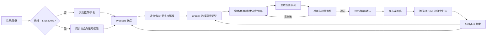

# Moras 电商营销产品竞品分析（第一版）

研究日期：2026-08-21

研究范围：Moras 官网公开页面 + 用户提供的 iOS App 截图；未登录后台、未连接 TikTok Shop、未读取手机其他数据。
目标：为“开发类似的电商营销程序”建立功能逻辑、竞品定位和 MVP 边界。

## 一、先给结论

Moras 的本质不是单点 AI 视频工具，而是一个面向 TikTok Shop US 联盟创作者的“商品到内容到成交复盘”工作流。它把选品、脚本、视频、语音、剪辑、合规、发布和数据分析组织成 11 个 AI 专家接力，移动端用 Creations / Products / Analytics 三个主入口承载闭环。

最值得对标的是三件事：

1. **商品上下文贯穿内容生产**：从商品研究列表直接进入创作，商品链接、价格、佣金和 CTA 不需要重复录入。
2. **把内容生产包装为可执行任务**：用户不需要先学会提示词、剪辑或选模型，只需选商品、审核结果、发布。
3. **用发布后的表现反哺下一次创作**：GMV、商品点击、视频表现和佣金成为下一次选品/创意的输入。

最大风险也很明确：平台依赖（TikTok Shop US）、收益预测可信度、内容政策和 OAuth 权限、AI 视频成本、发布接口可用性，以及“全自动”体验与用户实际审核需求之间的矛盾。

## 二、证据边界

### 已观察事实 `[F]`

- 官网首页标题定位为“Your Specialized AI Team Works Together to Turn Products Into Sales”，公开介绍 11 个 AI specialist，分为 Product Research、Video Creation、Publish & Improve 三阶段。
- 官网列出的专家包括 Market Researcher、Product Researcher、Photo Editor、Creative Strategist、Copywriter、Video Producer、Voice Actor、Video Editor、Compliance Specialist、Social Media Manager、Data Analyst。
- `/product-research` 公开页展示 TikTok Shop US、每日刷新、2.4M+ Products reviewed（官网宣传数字），字段包含 Pick/Score/Earnings/Winners/Order Lift/Competition，并可直接 Create video。
- `/tiktok-video-generator` 公开页描述：可粘贴商品链接、扫描商品或从 Product Research 选择；输出 hook、script、voice、captions、edit 和 shoppable CTA；页面列出 Seedance、Veo 3、Kling、Hailuo、Sora、Runway 等模型名，具体路由规则未公开。
- 官网公开两种模式：Moras Sell-for-you（页面文案为 30% creator commission，处理选品、视频和优化）与 Moras Self-serve（文案为 no commission cut，并列 AI Product Matching、Viral Video Creation、AI Avatar）。条款和价格可能变化，不能视为稳定报价。
- 截图 [b7cf7cbe2796f47b654dc487e05490f4.jpg] 展示 Creations 首屏：For you / My Videos、商品视频、评分、价格、预计 30 天收益、Dislike、Post Now、Creations/Products/Analytics 底部导航。
- 截图 [6ec4c2e30ead28fbc4f6686a8645cfdd.jpg] 展示 Products：Today's Top Pick、Top 1% order potential、商品评分/价格、Est. 30-day earnings、per sale、Create 和“其他用户赚取”的社会证明。
- 截图 [5d6a48b51372cab339001fc224cb1672.jpg] 展示 Settings：Self-serve Mode、每天最多 6 个 AI video creations、TikTok Shop 未连接、Earnings、Digital Avatar、Language、Terms 等设置项。
- 截图 [d382c67faffe3ef20c769955f7502cb5.jpg] 展示 Analytics：All/Yesterday/7 days/30 days、Attr. GMV、Attr. items sold、Product Performance 表格。
- 截图 [e4059879cee0366d69c719ce636fee38.jpg] 展示连接 TikTok Shop 的引导底 sheet，文案承诺连接后可创建并直接发布到 TikTok 账号。
- 截图 [5387bfa4f2af7380fff1e22dba032350.jpg] 展示 TikTok Shop Connected 页面，但当前仍显示“Connect Your TikTok Shop”，说明截图时尚未完成真实连接。

### 合理推断 `[I]`

- Moras 的核心对象至少包括 User、TikTok Shop/Account、Product、Creation/Video、Post、Content Metric、Attributed Order、Earnings/Quota 和 Digital Avatar。
- “Products → Create”与视频生成器的商品参数链接，说明商品是跨模块的主上下文，而不是一个孤立的商品列表。
- 11 个专家更像后端编排/能力角色，不应直接等价为 11 个独立可见页面；用户体验重点是交接结果和可审核状态。
- App 的前三个底部入口代表一个增长漏斗：发现/创作（Creations）→ 供给/选品（Products）→ 结果/归因（Analytics）。

### 仍待验证 `[H]`

- 是否真正支持 TikTok 官方发布 API，还是通过深链/系统分享完成发布。
- 选品 Score、Winners、Order Lift、Competition 的计算公式、时间窗、去重和数据来源。
- 预计收益如何计算，是否按个人账号、类目、地区和佣金率个性化。
- 每日额度的失败任务是否返还、不同模型成本如何结算、是否有队列优先级。
- 数字人训练所需素材、版权/肖像授权、声音克隆边界和跨视频一致性。
- AI 生成视频的所有权、平台 AI disclosure 和广告/联盟披露策略。

## 三、功能逻辑：从商品到销售复盘



### 1. 入口与激活

- 低门槛：官网强调 Start for free、No credit card required。
- 首要激活动作不是完善资料，而是连接 TikTok Shop 或从商品开始。
- 未连接时仍可浏览产品/内容，但“直接发布”被锁定；这是截图中最清晰的权限分界。
- 日额度/模式是核心约束：Self-serve 截图显示最多 6 次 AI 视频创建/天。产品应在生成前显示额度和失败重试规则。

### 2. 选品

- 推荐结果以“高订单潜力 + 可赚佣金 + 低竞争”表达，而不是只按销量排序。
- 商品卡的最小决策信息：商品图、标题、评分、价格、每单收益、时间窗总预估收益、趋势/订单信号、竞争度、Create。
- 选品的关键不是大盘本身，而是“推荐理由可理解”和“一键把同一商品交给创作链路”。

### 3. 创作

- 产品链接/详情 → 角度与 hook → script → product visual → voice → captions → edit → CTA。
- 公开页面支持 product review、AI avatar、faceless、tutorial、unboxing、before & after 等用例；首版不必同时实现全部类型。
- 生成任务必须是可恢复的异步状态：queued、processing、needs_review、ready、failed、published。
- 用户应该审核“商品是否正确、卖点是否夸大、字幕是否准确、链接是否正确、是否需要 AI/联盟披露”，而不是被迫调模型参数。

### 4. 发布

- 连接 TikTok Shop 后才进入发布动作；发布前应校验账号、商品链接、标题/字幕/标签、封面和政策风险。
- 发布成功的判定必须以平台返回的 post ID 为准，不以用户点击按钮为准。
- 需要提供导出/系统分享作为 API 不可用时的降级路径，但要明确“已发布”和“已导出”不是同一状态。

### 5. 分析与再创作

- App Analytics 以时间段筛选 Attr. GMV 和 Attr. items sold，再到 Product Performance 表格查看商品级表现。
- 官网 Data Analyst 的定位是解释 views、clicks、sales、commission 并指导下一条视频；这构成“数据反哺创作”的产品差异。
- 归因必须保留 creation_id、product_id、channel_account_id、platform_post_id，才能回答“哪条内容为哪件商品带来多少结果”。

## 四、移动端体验评估

| 观察 | 优点 | 风险/机会 |
|---|---|---|
| 三栏底部导航 | 心智简单，符合高频任务 | Creations 同时承载推荐流和我的视频，需明确筛选/状态 |
| 商品卡带 Create | 从发现到行动短 | 预估收益容易被误读为保证，应显示口径、时间窗、估算标签 |
| 视频底部 Post Now | 行动明确，适合冲动创作 | 发布是外部副作用，必须有最终确认、账号/商品检查和失败恢复 |
| Settings 集中连接、额度、数字人 | 账户能力可发现 | 连接 TikTok Shop 入口不应只藏在设置，首次创作前需要上下文引导 |
| Analytics 先看 GMV/销量 | 对联盟创作者直接 | 截图空表暴露冷启动问题，应提供无数据解释、同步时间和诊断动作 |
| 浅色大卡片视觉 | 适合消费型内容流 | 数据密度和长商品标题会挤压可读性，需测试动态字体/小屏/横向表格 |

## 五、竞品与替代方案

以下是“能力类别”的初版矩阵，具体版本和地区能力仍需逐一实测；不要把类别判断当作经过接口验证的事实。

| JTBD | Moras | TikTok Shop Seller Center/平台工具 | CapCut / Canva | UGC/创作者市场 | 目标产品机会 |
|---|---|---|---|---|---|
| 找值得推广的商品 | 强：推荐、评分、收益、竞争度、直接 Create `[F]` | 中：商品/店铺经营数据强，面向卖家而非独立联盟创作者 `[I]` | 弱：不是核心能力 `[I]` | 弱/中：靠创作者与品牌匹配 `[I]` | 做可解释的商品-内容机会分 |
| 不拍摄完成视频 | 强：脚本、语音、字幕、视频和 AI avatar `[F]` | 中：平台原生工具能力取决于地区/账号 `[H]` | 中/强：剪辑模板和素材强，但商品上下文要手动维护 `[I]` | 中：真人 UGC 更真实，但成本/周期更高 `[I]` | 用商品事实约束生成，降低幻觉 |
| 一键带商品链接发布 | 目标体验强，连接 TikTok Shop 后承诺直接发布 `[F]` | 强：平台原生权限和经营数据 `[I]` | 弱：通常需要手动发布/配置 `[I]` | 中：交付内容，不一定管理店铺发布 `[I]` | 设计 OAuth、深链、分享三路降级 |
| 看内容带来的销售 | 强：Attr. GMV、items sold、Product Performance `[F]` | 强：平台经营数据 `[I]` | 弱：通常看内容表现，不掌握订单归因 `[I]` | 中：可能有品牌侧报告，口径分散 `[I]` | 把 creation/product/order 作为一等关系 |
| 多平台扩张 | 当前公开叙事集中 TikTok Shop US `[F]` | 单平台强 | 多平台内容导出强，归因弱 | 依赖平台/人工协作 | 先做平台适配层，不先承诺多平台 |
| 团队/机构协作 | 官网公开信息有限 `[H]` | 卖家团队能力可能更强 `[H]` | 协作/素材能力较强 `[I]` | 协作是核心 | 作为第二阶段 B2B/agency 能力 |

### 竞品结论

Moras 的直接替代不是一个产品，而是“TikTok Shop 平台数据 + CapCut/Canva + 人工选品 + UGC 创作者 + 表格复盘”的组合。Moras 的壁垒因此更接近“上下文、编排和归因数据”，不只是生成质量。

## 六、对标产品建议

### MVP-1：商品到可发布视频的窄闭环

范围：一个地区（优先 TikTok Shop US 或你已有资源最强的平台）、一种角色（联盟创作者）、一种视频类型（无脸产品演示/评测）、一种归因口径。

- 商品链接导入/商品搜索。
- 基础商品事实卡：图片、标题、价格、评分、佣金/收益口径、来源时间。
- 3 个创意角度 + 1 条脚本 + 1 个视频生成任务。
- 视频预览、人工审核、导出或系统分享。
- 记录 creation、product、publish 状态，不急于全自动发布。
- 基础播放/点击/订单手动导入或单一平台同步。

### MVP-2：选品与内容实验

- 商品推荐分数可解释化。
- 同商品多角度/多 hook 版本。
- 版本对比、实验标签和内容级表现。
- “保留 / 迭代 / 停止”建议，而不是泛化的 AI 总结。

### MVP-3：平台连接和资产

- TikTok OAuth、账号切换、令牌撤销和审计。
- 数字人/声音/品牌资产管理。
- 真实发布 API + 系统分享降级。
- 团队、代理商、批量任务、额度和计费。

### 首版明确不做

- 不同时支持多个平台、多个国家和所有视频类型。
- 不承诺“爆款”“保证收益”或未经验证的市场排名。
- 不把 11 个 AI 专家做成 11 个独立页面。
- 不在没有真实归因数据前做复杂收益预测。
- 不把发布权限、支付和用户私有素材放进不可审计的黑盒流程。

## 七、关键数据对象与指标

```text
User
  └─ Shop / ChannelAccount
      ├─ Product
      │   └─ Creation ── Asset / VideoVersion ── PublishRecord
      │                                      └─ ContentMetric
      └─ AttributionOrder ── Earnings / QuotaLedger
```

首批必须能回答：

- 从哪个商品开始创作？
- 哪个视频版本发布到了哪个账号？
- 生成成本和额度消耗是多少？
- 哪个视频带来了多少播放、点击、订单、GMV 和佣金？
- 结果同步于何时、来自哪个平台、是否为估算？

建议北极星指标为“每个活跃创作者每周产生的有效归因内容收益”，前置指标包括商品到首稿耗时、生成成功率、审核通过率、发布率、有效播放率、商品点击率、归因订单率和 7/30 日留存。

## 八、下一步验证清单

1. 在已安装 App 中完成一次“选商品 → 生成 → 审核 → 发布/导出”任务，记录每一步可见状态、耗时、额度扣减和是否需要人工跳转。
2. 连接 TikTok Shop 前先核对权限范围、账号地区、店铺类型和发布 API 资格；不要在没有确认的情况下授权或发布。
3. 对 Products 页的 Score、Earnings、Winners、Order Lift、Competition 逐项截图/记录解释入口，确认时间窗和单位。
4. 获取一条真实内容的 platform_post_id、商品 ID、播放/点击/订单数据，验证归因链是否完整。
5. 访谈 5-10 位目标创作者，重点问“当前选品和做视频各需要多久、哪里最容易失败、什么数据会让他愿意继续发下一条”。

## 参考来源

- [Moras 官网](https://moras.ai/)
- [AI specialists](https://moras.ai/agents)
- [Product research](https://moras.ai/product-research)
- [TikTok video generator](https://moras.ai/tiktok-video-generator)
- [Pricing / Modes](https://moras.ai/pricing)
- [For TikTok Shop affiliates](https://moras.ai/use-cases/affiliates)
- 用户提供的 App 截图：`/Users/heself/Library/Containers/com.tencent.xinWeChat/Data/Documents/xwechat_files/wxid_lfshetyt1ix422_1b50/temp/RWTemp/2026-08/7e630d0ea71f9185674d03b162d1d588/`
